<meta name="viewport" content="width=device-width, initial-scale=1.0, minimum-scale=1.0">

  
# ZLFN [Kiroo]
**POSTECH 24'**

이것 저것 함니다.  
[[cv.pdf]](https://github.com/zlfn/zlfn/blob/main/cv/cv.pdf)
[[linkedin]](https://www.linkedin.com/in/pcung/)

<!--  -->

  
---

### Skills
#### 🏢 Professional Experience 🏢
##### [@hyperithm](https://www.hyperithm.com/) : Blockchain Infra Engineer

##### Freelance Works

---

##### 💚 Open Source Contributions & Projects 💚

##### 🎓 The Curriculum Made Me Do It 🎓

---

---

